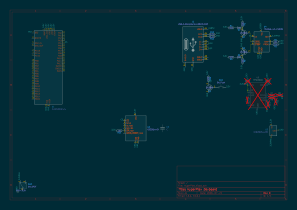

# July 21 - Created Journal, Did Research, Started Schematic

Through research, I've found that I can use the MounRiver Studio IDE for programming the chip I am going to be using, the CH32V203C8T6. I already picked out components I am going to be using.\
This has definitely been a lot more looking at datasheets than I expected lol. So far it's going very well, I have the Filter, Charger, and PSU for the charger designed in schematic.\
Currently working on the devboard that will attach to the console, the idea is basically a swap-out system where you can attach the devboard onto various modules, the first of which will be the game console.\
Bruh I just spent like 45 minutes on making a 5v power supply for the charger. The USB plug has to provide the power and it's already 5V :( Not a pro gamer move. Does mean there's one less thing to fit on the PCB!\

**TO-DO (Schematic):**
 - LDO Filter :D
 - 5V Supply for Charger :D
 - Charger :D
 - Storage Unit
 - Pinout :D

**Total time spent: ~2.75 Hours**

# July 22 - Finished Devboard Schematic, Finished Devboard PCB

I'm doing very well so far! I've decided to put the storage module on the attachment board, just so that you can only play games that are compatible with the module to prevent letting the magic smoke out.\
I want to put the LiPo battery on the board, but the only way I can do that and not extend the board dramatically is to put it on the bottom. There is space, but that would make it so that I'd have to add a connector to the attachment pads, and I don't know how I'm going to do that.\
It might be possible to do something like an extender?? I don't know.\
I can't figure out how to get a custom footprint to only appear on the bottom leyer. Time to Google! - Figured it out; I didn't have bottom footprints visible lol.\
I had an idea! What if I just kind of mount the lipo in top of the board? The only thing with that would be that the buttons would be blocked. Not sure.\
Devboard PCB layout finished! Going to get a quote from PCBWay to see what that expense will be. Probably will see in the morning.\

**TO-DO (Schematic):**
 - LDO Filter :D
 - 5V Supply for Charger :D
 - Charger :D
 - Storage Unit - Not adding
 - Pinout :D
 - Reset Button :D
 - USB Jack :D

**TO-DO (Devboard PCB):**
 - Organise Components :D
 - Make Footprint for Connector :D
 - Decide Where LiPo Goes - I think it will just be in the 3D-Printed case somewhere
 - Route Everything But Bottom Pads :D
 - Route Bottom Pads :D

Note: :D means that I did that task\

**Total time spent: ~5.5 Hours**

