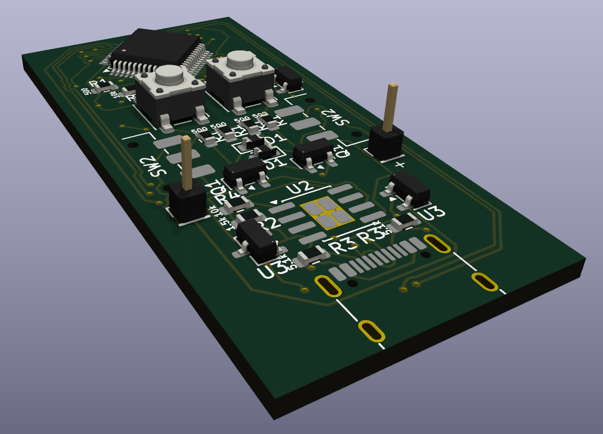

# Plex Console Stage 1
## A small devboard that attaches to modules to give endless emulation possibilities!
The way it works is simple: Have the main board, attach it to whatever output device is needed for the game you want to play, and bam! You have a small pocket-sized devboard with endless possibilities of emulation. All you have to do is make your attachment board, code the game, and snap on the main board!\
**This is Stage 1 of this project; it is just the Devboard. After I build this project and it (hopefully) works, I am going to move on to a tester module.**\
This is my first project as part of Hack Club, and I certainly hope it isn't my last! This has already been so fun, even just a couple hours in.

## Why & How
This project came about because i really liked Bitluni's Megaplex video (oh boy I wonder where the name came from), and I wanted to make something inspired by it.\
I initially was thinking of doing something exactly like his, but then realised that that would be a bad idea, and so I decided to make it my own by adding:
 - Different battery (rechargable!)
 - Modular snap-on system
 - Completely different display (ok this is an entirely different thing)

Thank you so much to Hack Club and Forge for making this whole thing possible! This really is an amazing oppurtunity.

## What is it?
This project firstly involves a devboard. The reason it isn't a single board with the I/O and everything is because the main devboard is one of the more expensive things (~$35-40 including shipping for components), and I wanted you to just have one for all of the possible modules. (Also because I wanted a concrete starting point)\
**Note: This is a test for just the devboard. I am going to make a case and print it myself when I have confirmation that it works.**\
The second part of the project is the modules. They snap onto the devboard with magnets and communicate with pads on the back of both. Modules can do anything, as long as you code it right and have enough I/O pins!

## What's the Plan?
I currently have the devboard designed and ready to ship off to JLCPCB when I get funding!\
The first module that I am going to create is just a simple screen made of Charlie-Plexed LEDS. This is mainly just to practice coding, get the connection between the devboard and module hammered down, and make sure that the devboard works of course.\
After that, I move on to the main idea: The Nintendon't GameMan. This is basically a Gameboy-like little pocket console with famous games like Tesris, Pac-Boy, and maybe even Toader! I haven't gotten to this point yet of course, but I am moving swiftly along.
Last but not least, if I have any extra time, I'd eventually like to make other attachments (feel free to leave suggestions).

## Current Progress:

### *Devboard*
*Schematic*\

*PCB Layout*\

*Built-in KiCad 3D Model Front*\

*Built-in KiCad 3D Model Back*\

## BOM

